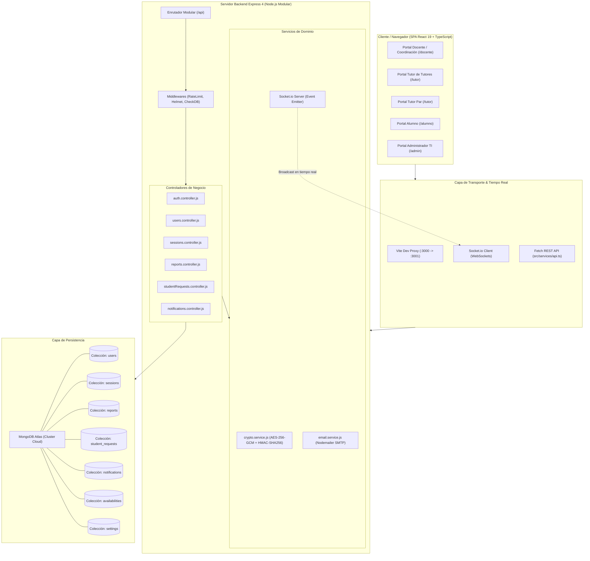
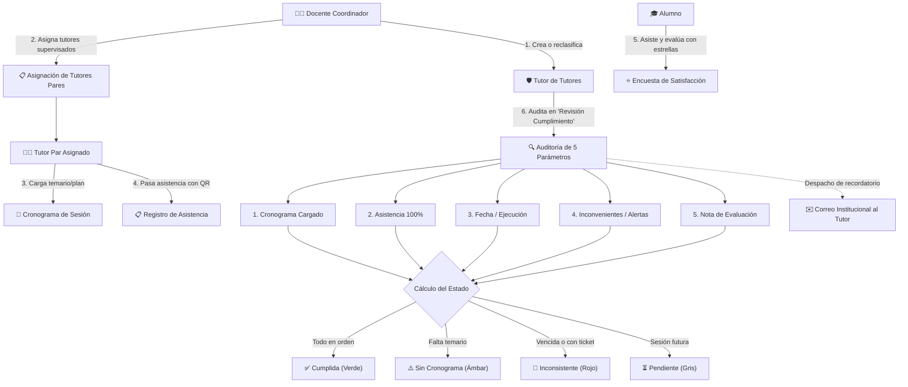
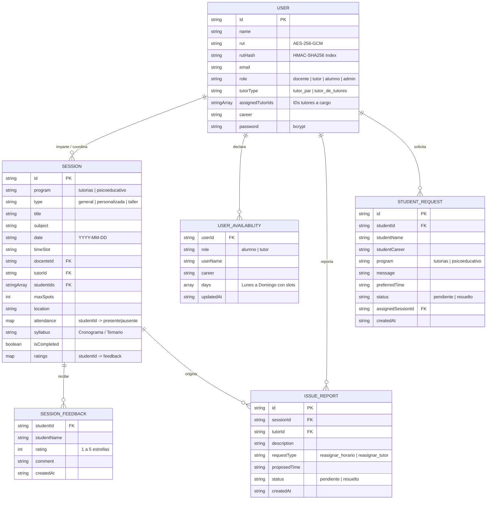
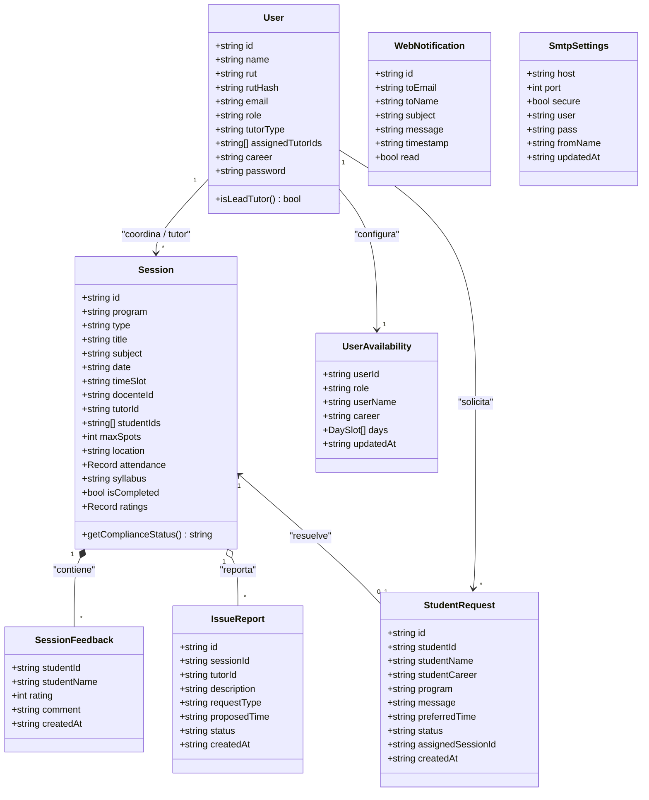
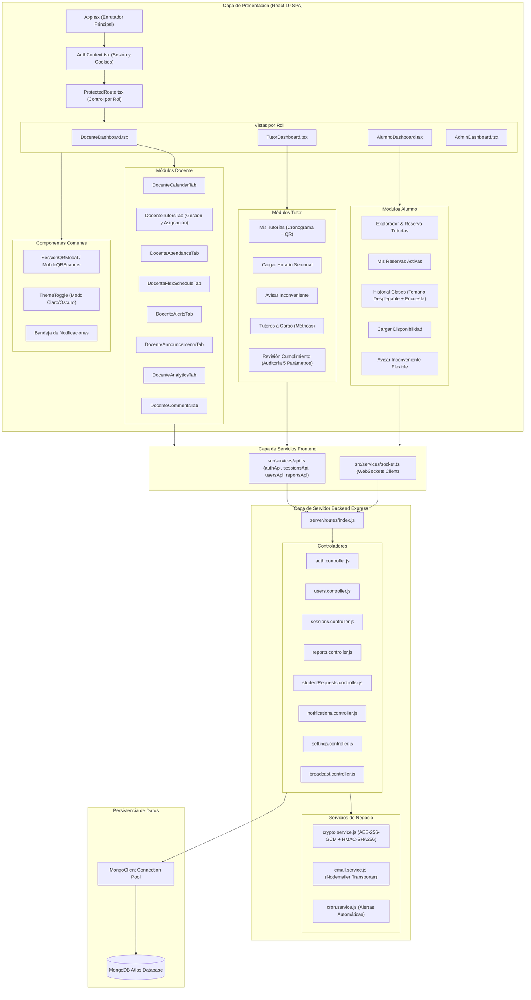

# Trayectoria Estudiantil UFT - Documento de Contexto

## 1. Descripción General del Proyecto

**Trayectoria UFT.** es una plataforma web integral desarrollada para la **Universidad Finis Terrae (UFT)** orientada a la gestión, reserva, coordinación flexible y seguimiento de programas de apoyo académico y acompañamiento estudiantil:
- **Programa de Tutorías Académicas (Entre Pares y Docentes)**.
- **Programa de Apoyo Psicoeducativo (Talleres de Hábitos de Estudio, Manejo de Ansiedad y Asesorías Individuales)**.

La aplicación permite la interacción fluida y modular de cuatro roles clave: **Docentes / Coordinadores**, **Tutores (Pares)**, **Alumnos** y **Administrador del Sistema**.

---

## 2. Diagramas de Arquitectura y Flujos del Sistema

### A. Arquitectura General del Sistema (C4 Container View)



### B. Flujo de Coordinación, Supervisión y Revisión de Cumplimiento



### C. Diagrama de Entidad-Relación (Modelo de Datos)



### D. Diagrama de Clases y Modelos de Dominio



### E. Diagrama de Componentes de Frontend y Backend



### F. Diagrama de Despliegue de Infraestructura

```mermaid
flowchart TD
    subgraph ClientNode["Nodo Cliente (Dispositivo de Usuario)"]
        Browser["Navegador Web (Chrome, Edge, Safari, Firefox)\n- React 19 SPA Bundle\n- Auth Cookies (7 días)\n- LocalStorage Cache\n- HTML5 QR Scanner / Camera"]
    end

    subgraph ApplicationHost["Servidor de Aplicación (Host Node.js / Linux VPS)"]
        subgraph WebServerLayer["Capa Web / Proxy Inverso"]
            ViteDev["Vite Dev Server (:3000)\nProxy /api -> :3001"]
        end

        subgraph AppServerLayer["Capa de Servidor Express (:3001)"]
            ExpressRuntime["Node.js + TSX Runtime (Watch Mode)"]
            RestAPI["API REST (/api/*)\n- Helmet (Cabeceras Seguras)\n- Express Rate Limit (120 req/min)"]
            SocketEngine["Socket.io Engine (WebSockets Server)\n- Eventos: sessions, users, notifications, reports"]
            CryptoEngine["Módulo Criptográfico Nativo (Node:crypto)\n- AES-256-GCM (Cipher/Decipher)\n- HMAC-SHA256 (Blind Indexing)"]
        end
    end

    subgraph CloudDatabase["Cluster Cloud MongoDB Atlas"]
        subgraph ReplicaSet["Cluster Replicado Multi-AZ (M0 / Dedicated)"]
            PrimaryDB[("Nodo Primario (Read/Write)")]
            SecondaryDB[("Nodos Secundarios (Replica Sync)")]
            PrimaryDB --- SecondaryDB
        end
        Collections["Colecciones Cifradas:\n- users (RUTs encriptados + rutHash)\n- sessions (syllabus + ratings)\n- student_requests, reports, notifications, availabilities, settings"]
        ReplicaSet --- Collections
    end

    subgraph ExternalServices["Servicios Externos Institucionales"]
        GoogleSMTP["Servidor SMTP Institucional (Google / UFT)\nPuerto 587 (STARTTLS / TLS)"]
        DNSResolvers["Resolutores DNS Globales\nGoogle Public DNS (8.8.8.8) / Cloudflare (1.1.1.1)"]
    end

    Browser -->|HTTPS / WSS (Puerto 3000/3001)| ViteDev
    ViteDev -->|Proxy HTTP/WS| ExpressRuntime
    ExpressRuntime --> RestAPI & SocketEngine
    RestAPI --> CryptoEngine
    RestAPI -->|MongoDB Connection Pool con TLS/SRV| PrimaryDB
    AppServerLayer -->|SMTP Auth + STARTTLS| GoogleSMTP
    AppServerLayer -->|DNS SRV Resolution| DNSResolvers
```

---

## 3. Stack Tecnológico

### Frontend
- **Framework / Librería**: React 19 con TypeScript.
- **Enrutamiento Declarativo**: `react-router-dom` v6 con rutas por rol (`/login`, `/docente`, `/alumno`, `/tutor`, `/admin`, `/reset-password`) y guardas de acceso (`ProtectedRoute`).
- **Bundler & Dev Server**: Vite 6 con soporte de proxy para endpoints `/api` hacia `http://localhost:3001`.
- **Estilos**: Tailwind CSS v4 (`@tailwindcss/vite`) con paleta institucional UFT (`#092c4c`, `#3a9ad9`).
- **Iconografía & Animación**: `lucide-react`, `motion` (Framer Motion).
- **Capa de Servicios**: Clientes API tipados en `src/services/api.ts`.
- **Persistencia de Sesión**: Cookies de navegador (`uft_session_user`, 7 días, SameSite=Lax, path=/) sincronizadas con `localStorage` y administradas mediante `AuthContext`.

### Backend & Seguridad
- **Runtime & Servidor**: Node.js con Express 4 modularizado por capas (Controladores, Servicios, Rutas y Middlewares).
- **Base de Datos**: MongoDB Atlas (driver oficial `mongodb` v7.x con pool de conexiones y cache `cachedDb`).
- **Seguridad Criptográfica & Datos Sensibles**:
  - **Cifrado en Reposo (Field-Level Encryption)**: RUTs cifrados en MongoDB Atlas con **AES-256-GCM** (`enc:<iv>:<tag>:<cipher>`) usando clave simétrica de 256 bits (`DATA_ENCRYPTION_KEY`).
  - **Blind Index Determinístico**: Búsquedas instantáneas $O(1)$ en MongoDB mediante **HMAC-SHA256** (`rutHash`).
  - **Hashing de Contraseñas**: `bcryptjs` con salt rounds para contraseñas de usuarios.
  - **Protección HTTP**: `helmet` y `express-rate-limit` (120 req/min general; máximo 10 intentos en 5 min en `/api/login`).
- **Servicio de Correos**: `nodemailer` para envíos reales vía Google SMTP / Gmail institucional configurables desde el panel de administración.
- **Ejecución TypeScript/ESM**: `tsx` para scripts y servidor Node.
- **Entorno de Desarrollo & CLI**: Antigravity CLI (`agy`) habilitado globalmente y accesos directos configurados en el Escritorio.

---

## 3. Lanzadores y Acceso Rápido (Antigravity CLI / Escritorio)
- **Comando en Terminal**: `agy` (o `antigravity-ide`) disponible directamente desde cualquier terminal de PowerShell o CMD.
- **Acceso Directo en Escritorio**:
  1. `Antigravity - Trayectoria UFT.lnk`: Acceso directo nativo con icono oficial de Antigravity que abre la carpeta del proyecto.
  2. `Abrir Antigravity - Trayectoria UFT.bat`: Script ejecutable sin restricciones para iniciar el entorno en esta carpeta de trabajo.

---

## 4. Estructura de Directorios Modular

```plaintext
trayectoria-estudiantil-uft/
├── .env / .env.example          # Variables de entorno (MONGODB_URI, DATA_ENCRYPTION_KEY, HMAC_SECRET, SMTP)
├── package.json                 # Dependencias y scripts de ejecución
├── tsconfig.json                # Configuración de TypeScript
├── vite.config.ts               # Configuración de Vite y proxy backend (/api -> localhost:3001)
├── server/                      # Capa Backend Modular (Arquitectura en Capas)
│   ├── db.js                    # Conexión con MongoClient, pool y helpers getDb / getOrConnectDB
│   ├── seed.js                  # Sembrado inicial de datos en MongoDB Atlas
│   ├── server.js                # Punto de entrada Express modular (< 60 líneas)
│   ├── middlewares/             # Middlewares (Rate limiters, verificación de DB)
│   │   ├── rateLimiters.js
│   │   └── checkDb.js
│   ├── services/                # Servicios del Dominio
│   │   ├── crypto.service.js    # Cifrado AES-256-GCM, HMAC-SHA256 Blind Index y sanitización
│   │   ├── email.service.js     # Configuración SMTP y despacho de correos
│   │   └── cron.service.js      # Tareas programadas y recordatorios automáticos
│   ├── controllers/             # Controladores de Negocio
│   │   ├── auth.controller.js   # Login, recuperación y verificación de contraseña
│   │   ├── users.controller.js  # CRUD de usuarios con cifrado transparente
│   │   ├── sessions.controller.js
│   │   ├── availabilities.controller.js
│   │   ├── reports.controller.js
│   │   ├── studentRequests.controller.js
│   │   ├── notifications.controller.js
│   │   ├── settings.controller.js
│   │   └── broadcast.controller.js
│   ├── routes/                  # Definición Modular de Rutas REST
│   │   ├── auth.routes.js
│   │   ├── users.routes.js
│   │   ├── sessions.routes.js
│   │   ├── availabilities.routes.js
│   │   ├── reports.routes.js
│   │   ├── studentRequests.routes.js
│   │   ├── notifications.routes.js
│   │   ├── settings.routes.js
│   │   ├── broadcast.routes.js
│   │   ├── cron.routes.js
│   │   ├── email.routes.js
│   │   └── index.js             # Enrutador maestro /api (con endpoint /api/health)
│   └── scripts/                 # Scripts de Utilidad y Migración
│       ├── migrate-encrypt-ruts.js # Migración de RUTs planos a AES-256-GCM en Atlas
│       └── test-encryption-verification.js # Verificación de seguridad criptográfica
├── src/                         # Capa Frontend Modular (SPA React 19 + TypeScript)
│   ├── main.tsx                 # Entrada principal React DOM
│   ├── App.tsx                  # Enrutador BrowserRouter con rutas protegidas por rol
│   ├── types.ts                 # Tipado TypeScript unificado
│   ├── data.ts                  # Helpers de fechas dinámicas, formateo de RUT y respaldos
│   ├── index.css                # Estilos globales y tokens
│   ├── context/                 # Estado Global de Autenticación
│   │   └── AuthContext.tsx      # Provider con cookies, logout y useAuth()
│   ├── services/                # Capa de Servicios API Frontend
│   │   └── api.ts               # Clientes API tipados (authApi, usersApi, sessionsApi, etc.)
│   └── components/              # Vistas y Subcomponentes por Rol
│       ├── LoginScreen.tsx      # Pantalla de acceso con soporte admin y registro
│       ├── ResetPasswordScreen.tsx
│       ├── ForgotPasswordModal.tsx
│       ├── TermsAndConditionsModal.tsx
│       ├── TutorDashboard.tsx   # Panel de Tutores Pares modularizado
│       ├── AlumnoDashboard.tsx  # Panel de Estudiantes modularizado
│       ├── AdminDashboard.tsx   # Panel Central de Administración TI
│       ├── DocenteDashboard.tsx # Panel de Coordinación y Docencia
│       ├── routes/              # Guardas de Navegación
│       │   └── ProtectedRoute.tsx # Control de acceso por rol y redirección
│       ├── admin/               # Submódulos del Administrador
│       │   ├── AdminDocentesTab.tsx
│       │   ├── AdminTutoresTab.tsx
│       │   ├── AdminAlumnosTab.tsx
│       │   ├── AdminSmtpTab.tsx
│       │   └── EditUserModal.tsx
│       └── docente/             # Submódulos del Docente
│           ├── DocenteSidebar.tsx
│           ├── DocenteCalendarTab.tsx
│           ├── DocenteCreateSessionTab.tsx
│           ├── DocenteAttendanceTab.tsx
│           ├── DocenteFlexScheduleTab.tsx
│           ├── DocenteTutorsTab.tsx
│           ├── DocenteStudentsTab.tsx
│           ├── DocenteAlertsTab.tsx
│           ├── DocenteAnnouncementsTab.tsx
│           ├── DocenteAnalyticsTab.tsx
│           └── DocenteCommentsTab.tsx
└── contexto.md                  # Documentación de contexto y funcionamiento del proyecto
```

---

## 4. Cuentas de Prueba Configuradas

| Rol | Nombre | RUT | Contraseña | Propósito |
| :--- | :--- | :--- | :--- | :--- |
| **Docente** | Viviana Carrasco | `11.111.111-1` | `123` | Coordinación docente, aprobación de horarios y alertas. |
| **Tutor Par** | Carlos Valenzuela | `18.456.789-K` | `123` | Gestión de tutorías asignadas y toma de asistencia. |
| **Alumno** | Mayra Linco | `20.123.456-7` | `123` | Inscripción en talleres, historial y avisos de tope. |
| **Admin** | Administrador TI | `admin` | `1234` | Panel central de administración TI, gestión de usuarios y SMTP. |

---

## 5. Modelos de Datos y Entidades (`src/types.ts`)

1. **`User`**:
   - `id`, `name`, `rut`, `role` (`'docente' | 'tutor' | 'alumno' | 'admin'`), `email`, `career`, `password`.
   - En base de datos se almacena además `rutHash` (índice ciego HMAC-SHA256) y el RUT cifrado con AES-256-GCM.
2. **`Session`**:
   - `id`, `program` (`'tutorias' | 'psicoeducativo'`), `type`, `title`, `subject`, `date`, `timeSlot`, `docenteId`, `tutorId`, `studentIds`, `maxSpots`, `location`, `attendance`, `ratings`, `isCompleted`.
3. **`StudentRequest`**:
   - Solicitudes por topes horarios o incompatibilidad enviadas por estudiantes.
   - `id`, `studentId`, `studentName`, `studentCareer`, `program`, `message`, `preferredTime`, `status`, `assignedSessionId`, `createdAt`.
4. **`UserAvailability`**:
   - Matriz de disponibilidad horaria semanal por bloques para tutores y alumnos.
5. **`IssueReport`**:
   - Alertas o solicitudes de reasignación creadas por tutores (topes de horario, cambio de tutor).
6. **`WebNotification`**:
   - Notificaciones y comprobantes despachados a los correos de los usuarios.
7. **`SmtpSettings`**:
   - Configuración del servidor de correos guardada en MongoDB Atlas (Host, Puerto, SSL, Usuario, Password encriptada, Remitente).

---

## 6. Módulos y Flujos de Trabajo

### A. Autenticación y Navegación Protegida
- **URLs Dedicadas**: Cada rol posee su propia ruta protegida: `/docente`, `/alumno`, `/tutor` y `/admin`.
- **Persistencia de Pestaña Activa**: Al recargar la página (`F5`), el sistema recuerda automáticamente la pestaña o vista en la que se encontraba el usuario (Métricas, Pasar Lista, Disponibilidad, Calendario, etc.) mediante `localStorage`.
- **Guardas de Acceso (`ProtectedRoute`)**: Redirigen a `/login` si no hay sesión activa, o a la ruta correspondiente al rol si se intenta acceder a una sección ajena.
- **Login Inteligente**: Permite el ingreso con `admin` / `1234` o RUT chileno de 9 dígitos.
- **Cierre de Sesión Unificado**: Botón visible y permanente en la barra superior o pie de sidebar de cada panel, sin popups redundantes ni menús invasivos.

### B. Cifrado y Confidencialidad de Datos en Reposo
- Los RUTs se almacenan bajo el formato `enc:<iv_hex>:<tag_hex>:<cipher_hex>`.
- Las consultas y autenticaciones se resuelven en $O(1)$ gracias al Blind Index (`rutHash`), garantizando alta velocidad sin exponer datos personales.
- Al consultar usuarios a través de la API, el backend desencripta el RUT en memoria de forma segura y sanitiza la salida omitiendo contraseñas y hashes.

### C. Módulo Docente / Coordinador (`DocenteDashboard.tsx`)
- **Barra lateral fija (`sticky top-0 h-screen`)**: Permite navegar entre las 10 pestañas (Calendario, Crear Sesión, Pasar Lista, Horarios Flexibles, Tutores, Estudiantes, Alertas, Comunicados, Analítica y Comentarios) sin que los botones de acción se oculten al hacer scroll.
- **Analítica, Rankings y Exportación a Excel (`DocenteAnalyticsTab.tsx`)**:
  - **KPIs Globales**: Sesiones agendadas/completadas, Tasa de asistencia porcentual (`%`), Alumnos atendidos e inscripciones activas.
  - **Ranking de Mayor Asistencia**: Tabla dinámica que ordena y destaca las tutorías y talleres con mayor convocatoria y porcentaje de asistencia efectiva.
  - **Tutores con Mayor Participación**: Métricas por tutor (cantidad de sesiones dirigidas y total de estudiantes acompañados).
  - **Exportación a Excel Nativo con Estilos Corporativos (`.xlsx` vía ExcelJS)**:
    - Genera planillas binarias auténticas **OpenXML `.xlsx`** que se abren sin advertencias de seguridad en Microsoft Excel.
    - **Diseño Corporativo UFT Incluido**:
      - Banners superiores en azul marino institucional (`#092c4c`) y subtítulos en azul noche (`#061e34` / `#3a9ad9`).
      - Encabezados con contraste blanco y bordes finos.
      - Filas con relleno alternado (cebreado blanco / gris suave `#f8fafc`).
      - Resaltado condicional de colores para tasas de asistencia y estados (`PRESENTE` en verde `#047857`, `AUSENTE` en rojo `#b91c1c`, `PENDIENTE` en ámbar).
      - Auto-ajuste de ancho y alineación inteligente de celdas (centrado para IDs, fechas y porcentajes; izquierda para nombres y materias).
    1. *Resumen de Sesiones y Clases*: Detalle completo de fechas, tutores, inscritos y asistencias.
    2. *Desempeño y Carga de Tutores*: Alumnos acompañados, asistencias y tasa de efectividad.
    3. *Asistencia Detallada Alumno por Alumno*: Registro nominal con RUT, carrera, correo institucional y estado puntual.
- **Seguridad en Base de Datos**:
  - Cifrado a nivel de campo AES-256-GCM para RUTs de usuarios.
  - Índice ciego HMAC-SHA256 (`rutHash`) para búsquedas exactas $O(1)$ sin comprometer privacidad.
- **Rutas Protegidas y Modulares**:
  - Backend estructurado en `routes/`, `controllers/`, `services/`, `middlewares/`.
  - Frontend con React Router v6 y `ProtectedRoute` por roles.
- **Sistema Transaccional de Correos SMTP**:
  - 11 flujos de notificación auditados y validados.
  - Incrustación inline CID del logotipo oficial (`logo-uft.png`) para visualización inmediata sin bloqueos en clientes de correo.
- **Coordinación Flexible**: Visualización y adjudicación directa de solicitudes de horario con despacho automático de correos institucionales al alumno y al tutor asignado.

### D. Módulo de Tutores y Subtipo Tutor de Tutores (`TutorDashboard.tsx`)
- **Tutor Par (Estándar)**:
  - **Mis Tutorías**: Visualización de sesiones asignadas, temarios/cronogramas y registro rápido de asistencia estudiantil con código QR interactivo.
  - **Cargar Horario**: Carga de matriz de disponibilidad horaria semanal (Lunes a Domingo) sincronizada con MongoDB Atlas.
  - **Avisar Inconveniente**: Envío de alertas de cambio de horario o sustitución de tutor con despacho automático a todos los docentes coordinadores.
- **Tutor de Tutores (Coordinador de Pares)**:
  - Cuenta con todos los módulos del tutor par y agrega dos pestañas exclusivas:
    1. **"Tutores a Cargo"**: Monitoreo de nómina supervisada, semáforo de estado, cantidad de tutorías, cronogramas y asistencia.
    2. **"Revisión Cumplimiento"**: Vista detallada por tutor par con listado de sesiones en tarjetas y badges de estado:
       - `Cumplida` (Verde): Cronograma cargado y asistencia de alumnos tomada.
       - `Sin cronograma` (Ámbar): Sesión sin temario registrado por el tutor.
       - `Inconsistente` (Rojo): Reportes pendientes o inasistencias sin registrar en fechas pasadas.
       - `Pendiente` (Gris): Sesión programada próxima a ejecutarse.
       - **Desglose Interactivo al Hacer Clic en una Tutoría**: Al presionar cualquier sesión, se despliega un acordeón con la auditoría de los 5 parámetros evaluados:
         - **1. Carga de Cronograma/Temario** (`Poner cronograma`): Verificación del plan de trabajo ingresado por el tutor.
         - **2. Registro de Asistencia** (`Pasar asistencia`): Conteo de inscritos y lista individual de alumnos (`Presente`, `Ausente`, `Pendiente`).
         - **3. Ejecución Temporal y Fecha**: Control de fecha futura vs vencida sin registro.
         - **4. Inconvenientes / Alertas**: Revisión de tickets de reporte abiertos por el tutor.
         - **5. Nota y Evaluación de Satisfacción Estudiantil**: Visualización del promedio de estrellas (1 a 5), total de encuestas recibidas y detalle individual de notas y comentarios enviados por los estudiantes.
         - **Badge en Cabecera**: Muestra directamente en la tarjeta de la tutoría el puntaje promedio obtenido (ej. `⭐ 5.0 (2)`).
         - **Explicación del Cálculo**: Dictamen que detalla la fórmula institucional aplicada para obtener el estado de cumplimiento.
         - **Acción Rápida**: Botón para enviar recordatorios personalizados por correo electrónico al tutor par respecto a esa sesión específica.

- **Apartado de Asignación en Panel Docente (`DocenteTutorsTab.tsx`)**:
  - Opción de registrar y editar tutores clasificándolos como **Tutor Par** o **Tutor de Tutores**.
  - Sección interactiva **"Asignar Tutores a Cargo"** para que los docentes coordinadores elijan un Tutor de Tutores y le asignen tutores pares mediante selección múltiple.

### E. Módulo Alumno (`AlumnoDashboard.tsx`)
- **Explorador y Reserva**: Inscripción inmediata en tutorías colectivas y talleres psicoeducativos con validación de anticipación (mínimo 2 horas antes).
- **Mis Reservas Activas**: Listado de sesiones agendadas con datos del tutor y temario visible.
- **Historial de Clases y Asistencias**:
  - Registro histórico de tutorías completadas y control de asistencia individual.
  - **Cronograma y Temario Desplegable**: Cada tarjeta de clase en el historial cuenta con un acordeón interactivo para ver los contenidos y temas trabajados ingresados por el tutor.
  - **Encuesta de Satisfacción**: Calificación por estrellas (1 a 5) y envío de comentarios o retroalimentación.
- **Bandeja de Mensajes y Comunicados**: Modal flotante institucional con filtros de tiempo ("Última Semana" / "Histórico Completo") y marcado interactivo de leídos.
- **Avisar Inconveniente**: Formulario para solicitar horario flexible con notificación automática a los docentes coordinadores.

### F. Módulo Administrador (`AdminDashboard.tsx`)
- **Nómina y Gestión de Docentes, Tutores y Estudiantes**: Alta, edición modal y baja de usuarios en MongoDB Atlas con filtros seguros contra valores nulos.
- **Configuración SMTP & Pruebas en Vivo**: Guardado de parámetros en la colección `settings` y simulaciones en vivo de recordatorios de tutoría y avisos de alumnos.

---

## 7. Endpoints de la API REST

| Método | Endpoint | Descripción |
| :--- | :--- | :--- |
| `GET` | `/api/health` | Estado de conexión y recuento de documentos en MongoDB Atlas |
| `POST` | `/api/login` | Autenticación con verificación `bcrypt` y búsqueda por `rutHash` |
| `POST` | `/api/forgot-password` | Solicitud de restablecimiento de contraseña vía correo SMTP |
| `GET` | `/api/verify-reset-token` | Validación de vigencia de token de recuperación |
| `POST` | `/api/reset-password` | Actualización de contraseña con hash `bcrypt` |
| `GET` / `POST` | `/api/users` | Listado y registro de usuarios con cifrado de RUT |
| `PUT` / `DELETE` | `/api/users/:id` | Edición y eliminación de usuario en MongoDB Atlas |
| `GET` / `POST` | `/api/sessions` | Obtención y creación de sesiones académicas |
| `PUT` / `DELETE` | `/api/sessions/:id` | Actualización de asistencia, temario y cancelación |
| `GET` / `POST` | `/api/student-requests` | Listado y envío de solicitudes de horario flexible |
| `PUT` | `/api/student-requests/:id` | Actualización de estado de solicitud a resuelta |
| `GET` / `POST` | `/api/availabilities` | Consulta y guardado de disponibilidad horaria semanal |
| `GET` / `POST` | `/api/reports` | Gestión de alertas e incidencias reportadas por tutores |
| `GET` / `POST` | `/api/notifications` | Consulta y guardado de notificaciones institucionales |
| `PUT` | `/api/notifications/:id/read` | Marcar notificación individual como leída |
| `PUT` | `/api/notifications/read-all` | Marcar todas las notificaciones como leídas |
| `GET` / `POST` | `/api/settings/smtp` | Lectura y guardado de credenciales SMTP en MongoDB |
| `POST` | `/api/settings/smtp/test` | Prueba en vivo de despacho SMTP |
| `POST` | `/api/broadcast-message` | Despacho masivo o por sesión de comunicados oficiales |
| `POST` | `/api/send-email` | Despacho general de correos institucionales |

---

## 8. Comandos de Ejecución

- `npm run server`: Inicia el servidor backend Express modular (`localhost:3001`).
- `npm run client`: Inicia el servidor de desarrollo Vite (`localhost:3000`).
- `npm run dev`: Inicia concurrentemente backend (`3001`) y frontend (`3000`).
- `npm run lint`: Ejecuta el chequeo de tipos TypeScript (`tsc --noEmit`).
- `npm run build`: Genera el paquete optimizado de producción en `/dist`.
